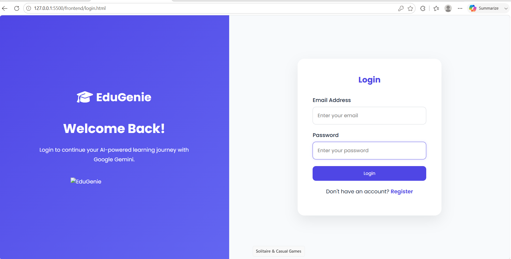
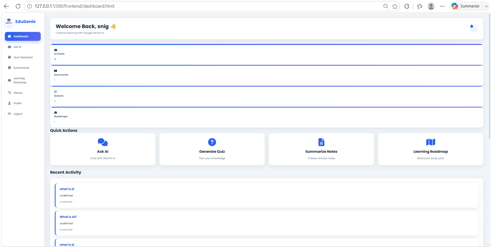
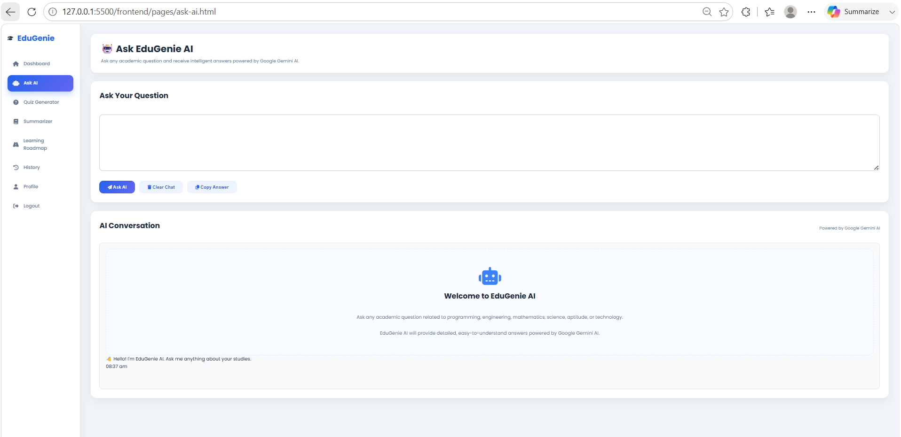
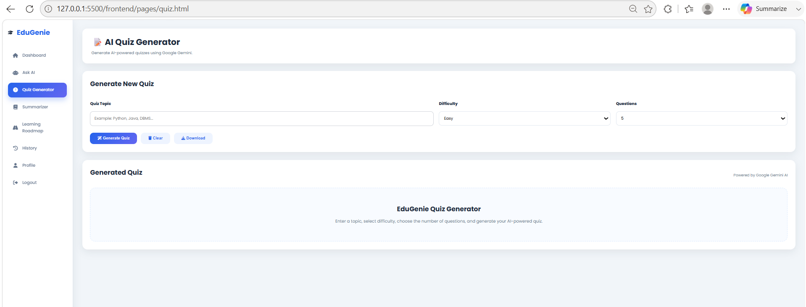
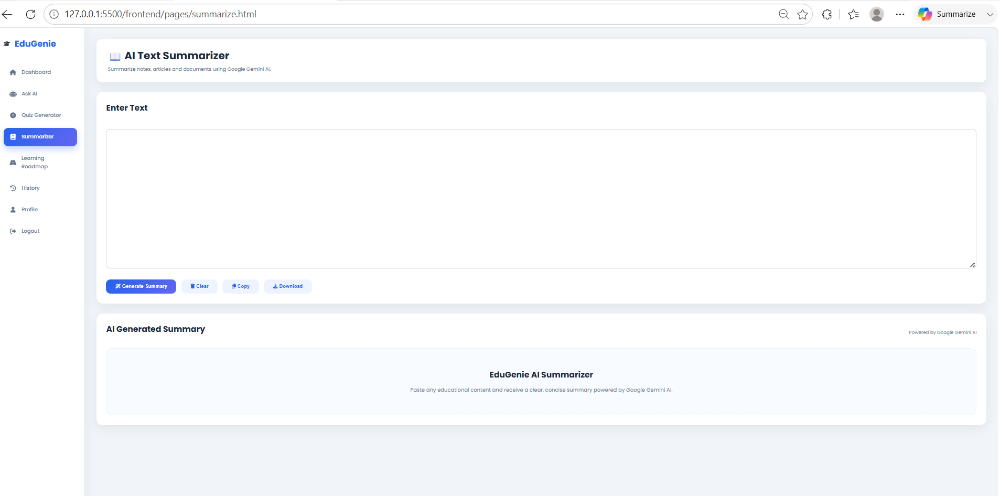
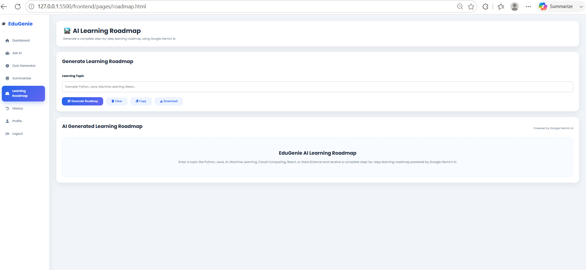
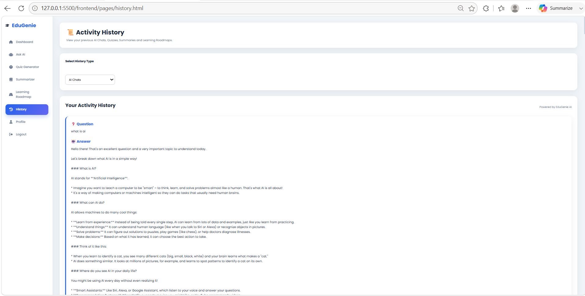
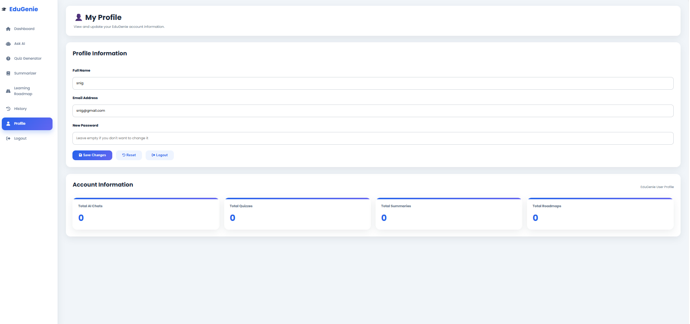

# 🎓 EduGenie AI

An AI-powered educational assistant that helps students learn more effectively using Google Gemini AI.

EduGenie allows users to:

- 🤖 Ask academic questions
- 📝 Generate quizzes
- 📚 Summarize long notes
- 🗺️ Create personalized learning roadmaps
- 📜 View activity history
- 👤 Manage user profiles

The application is built using **FastAPI**, **SQLite**, **HTML**, **CSS**, and **JavaScript**, providing a simple and responsive interface for students.

---

## 🚀 Features

- User Registration & Login
- JWT Authentication
- AI Question Answering
- Quiz Generation
- Text Summarization
- Learning Roadmap Generator
- Dashboard with Statistics
- Activity History
- User Profile Management
- Responsive UI

---

## 🛠️ Technology Stack

### Frontend
- HTML5
- CSS3
- JavaScript (ES6)
- Fetch API

### Backend
- FastAPI
- Python 3.12
- SQLAlchemy
- Pydantic
- Uvicorn

### Database
- SQLite

### Authentication
- JWT (JSON Web Token)
- Passlib (Bcrypt)

### Artificial Intelligence
- Google Gemini AI API

### Development Tools
- Visual Studio Code
- Git & GitHub
- Swagger UI
- Postman

## 📁 Project Structure

```text
EduGenie/
│
├── backend/
│   ├── app/
│   │   ├── api/
│   │   ├── core/
│   │   ├── database/
│   │   ├── schemas/
│   │   ├── services/
│   │   └── main.py
│   │
│   ├── .env
│   ├── requirements.txt
│   └── edugenie.db
│
├── frontend/
│   ├── assets/
│   ├── css/
│   ├── js/
│   ├── pages/
│   ├── dashboard.html
│   ├── login.html
│   └── register.html
│
├── screenshots/
│
└── README.md
```

## ⚙️ Installation Guide

### 1. Clone the Repository

```bash
git clone https://github.com/yourusername/EduGenie.git
```

### 2. Navigate to the Project

```bash
cd EduGenie
```

### 3. Create a Virtual Environment

```bash
python -m venv venv
```

### 4. Activate the Virtual Environment

Windows

```bash
venv\Scripts\activate
```

Linux / macOS

```bash
source venv/bin/activate
```

### 5. Install Dependencies

```bash
pip install -r requirements.txt
```

### 6. Configure Environment Variables

Create a `.env` file inside the backend folder.

Example:

```env
GEMINI_API_KEY=YOUR_API_KEY
SECRET_KEY=edugenie_secret_key
ALGORITHM=HS256
ACCESS_TOKEN_EXPIRE_MINUTES=60
DATABASE_URL=sqlite:///./edugenie.db
```

### 7. Run the Backend

```bash
uvicorn main:app --reload
```

Backend URL:

```
http://127.0.0.1:8000
```

Swagger Documentation:

```
http://127.0.0.1:8000/docs
```

### 8. Run the Frontend

Open the frontend using Live Server or any static web server.

Example:

```
http://127.0.0.1:5500/frontend/login.html
```

## ▶️ How to Use

1. Register a new account.
2. Log in using your credentials.
3. Access the dashboard.
4. Ask academic questions using Gemini AI.
5. Generate quizzes on any topic.
6. Summarize long notes.
7. Create personalized learning roadmaps.
8. View activity history.
9. Update your profile.

## 🌐 REST API Documentation

### Authentication APIs

| Method | Endpoint | Description |
|---------|----------|-------------|
| POST | `/auth/register` | Register a new user |
| POST | `/auth/login` | User login |
| GET | `/auth/me` | Get logged-in user profile |
| PUT | `/auth/profile` | Update user profile |

---

### Artificial Intelligence APIs

| Method | Endpoint | Description |
|---------|----------|-------------|
| POST | `/ai/ask` | Ask questions to Gemini AI |
| POST | `/ai/quiz` | Generate quizzes |
| POST | `/ai/summarize` | Summarize text |
| POST | `/ai/roadmap` | Generate learning roadmap |

---

### History APIs

| Method | Endpoint | Description |
|---------|----------|-------------|
| GET | `/history/chats` | View AI chat history |
| GET | `/history/quizzes` | View quiz history |
| GET | `/history/summaries` | View summary history |
| GET | `/history/roadmaps` | View roadmap history |

---

### Dashboard APIs

| Method | Endpoint | Description |
|---------|----------|-------------|
| GET | `/dashboard/stats` | Dashboard statistics |
| GET | `/dashboard/recent-activities` | Recent user activities |

## 🏗️ System Architecture

```text
                  +----------------------+
                  |      Student         |
                  +----------+-----------+
                             |
                             |
                    HTML / CSS / JavaScript
                             |
                             |
                     Fetch REST APIs
                             |
                             ▼
                  +----------------------+
                  |     FastAPI Server   |
                  +----------+-----------+
                             |
     +-----------------------+----------------------+
     |                       |                      |
     ▼                       ▼                      ▼
Authentication         Gemini AI Service     History Service
     |                       |                      |
     +-----------------------+----------------------+
                             |
                             ▼
                    SQLAlchemy ORM
                             |
                             ▼
                     SQLite Database
```

## 🗄️ Database Design

EduGenie uses SQLite to store user information and AI activity history.

### Database Tables

- Users
- ChatHistory
- QuizHistory
- SummaryHistory
- RoadmapHistory

### Relationships

```text
Users
│
├── ChatHistory
├── QuizHistory
├── SummaryHistory
└── RoadmapHistory
```

Each history table is linked to the Users table using a Foreign Key (`user_id`).
## 📸 Screenshots

### Login Page



---

### Dashboard



---

### Ask AI


---

### Quiz Generator



---

### Text Summarizer



---

### Learning Roadmap



---

### History



---

### Profile



## 🚀 Future Enhancements

- Voice-based AI Assistant
- PDF Upload & AI Analysis
- AI Flashcard Generator
- AI Notes Generator
- Dark Mode
- Multi-language Support
- AI Study Planner
- Email Notifications
- Admin Dashboard
- Mobile Application (Android & iOS)

## 👨‍💻 Author

**Name:** Sanjay Benny Vemuri

**Project:** EduGenie AI

**Technology Stack:** FastAPI, Python, HTML, CSS, JavaScript, SQLite, Google Gemini AI

**GitHub:** https://github.com/your-github-username

## 📄 License

This project is developed for educational and learning purposes.

You are free to use, modify, and enhance this project for academic or personal use.

## 🙏 Acknowledgements

- Google Gemini AI
- FastAPI
- SQLAlchemy
- SQLite
- Pydantic
- JWT Authentication
- Visual Studio Code